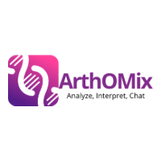

<p align="center">
  
</p>


**ArthOMix** is a Shiny application for both single and multi--omics analysis — transcriptomics, methylomics, cross-omics integration, and multi-omics ArthOChatin one interactive tool. 

**Live app:** [https://arthomix-differential-methylation-multiomics.serveousercontent.com/](https://arthomix-differential-methylation-multiomics.serveousercontent.com/)

## Overview

ArthOMix lets a researcher take omics data — to either uploaded files, fetch GEO accession, or use the pre-loaded reference datasets — through a full analysis pipeline entirely inside the browser: sex-specific, sex-pooled differential expression, methylation, WGCNA co-expression modules, cross-omics concordance, and multi-omics integration (MOFA2, DIABLO, similarity network fusion), with an AI assistant ("ArthOChat") that can summarize results from any stage.


## Features

- **Transcriptomics** — differential expression, WGCNA, enrichment, nomogram, candidate gene selection
- **Methylomics** — QC, DMP/DMR analysis, WGCNA, candidate CpG selection, external validation
- **Cross-Omics** — expression–methylation integration, biomarker convergence, Mendelian Randomization
- **Multi-Omics** — MOFA2, DIABLO, and Similarity Network Fusion (SNF) integration, with a Biomarker Card summarizing cross-omics evidence
- **Flexible data intake** — upload your own files, pull a dataset by GEO accession, or use pre-loaded datasets, with each intake path isolated per pipeline.
- **ArthOChat** — an in-app AI assistant that summarizes live results from any of the four sub-modules.
- **Result tracking** — every analysis run records a provenance manifest for reproducibility

## How to use ArthOmix?

- **User guide** — It consist of all the user guide for each modules with screenshots.

- **Video** — You can also see Video tutorial for ArthOMix.


See [`ArthOMix/PUBLICATION_PIPELINE.md`](ArthOMix/PUBLICATION_PIPELINE.md) for the full stage-by-stage map of every vertical, and [`ArthOMix/CODE_MAP.md`](ArthOMix/CODE_MAP.md) for where each analysis lives in the codebase.

## Sample data

The app supports three ways to bring in data for each vertical (Transcriptomics, Methylomics, Multi-Omics):

- **Upload** your own expression/methylation matrices
- **GEO accession** — pull a public dataset directly by GEO ID
- **Preloaded reference datasets** — bundled RA datasets for exploring the app without external data

## Testing

```sh
cd ArthOMix
Rscript -e 'testthat::test_dir("tests/testthat")'
```

Tests run automatically on push via [`.github/workflows/r-tests.yml`](.github/workflows/r-tests.yml).

## Contributing

Issues and pull requests are welcome. Please open an issue describing the change before submitting a large PR.

## Links

- **Live app** — [https://arthomix-differential-methylation-multiomics.serveousercontent.com/](https://arthomix-differential-methylation-multiomics.serveousercontent.com/)
- **Repository** — [github.com/shweta-rai11/ArthOMix-app](https://github.com/shweta-rai11/ArthOMix-app)

## References

- Shiny dashboard best practices.

## License

The code in this project is licensed under MIT license.
